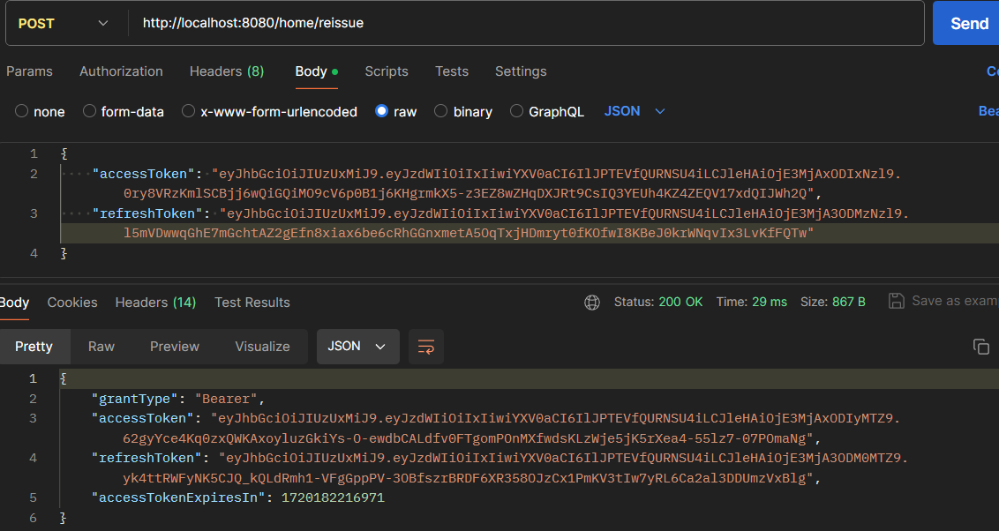

# Security + JWT 회원가입/로그인


# **Spring Initializr**

- Gradle
- Java 17
- Spring Boot 3.3.1
- Jar
- Dependency
    - Spring Web
    - Spring Security
    - Spring Data JPA
    - Lombok
    - H2 Database
    - JWT
## 프로젝트 구조
 

---


## build.gradle
```GRADLE
plugins {
    id 'java'
    id 'org.springframework.boot' version '3.3.1'
    id 'io.spring.dependency-management' version '1.1.5'
}

group = 'com.wayback'
version = '0.0.1-SNAPSHOT'

java {
    toolchain {
        languageVersion = JavaLanguageVersion.of(17)
    }
}

configurations {
    compileOnly {
        extendsFrom annotationProcessor
    }
}

repositories {
    mavenCentral()
}

dependencies {
    implementation 'org.springframework.boot:spring-boot-starter-data-jpa'
    implementation 'org.springframework.boot:spring-boot-starter-security'
    implementation 'org.springframework.boot:spring-boot-starter-validation'
    implementation 'org.springframework.boot:spring-boot-starter-web'
    implementation 'org.testng:testng:7.7.0'
    testImplementation 'org.springframework.boot:spring-boot-starter-test'
    testImplementation 'org.springframework.security:spring-security-test'

    compileOnly 'org.projectlombok:lombok'
    annotationProcessor 'org.projectlombok:lombok'

    runtimeOnly 'com.h2database:h2'

    implementation group: 'io.jsonwebtoken', name: 'jjwt-api', version: '0.11.5'
    runtimeOnly group: 'io.jsonwebtoken', name: 'jjwt-impl', version: '0.11.5'
    runtimeOnly group: 'io.jsonwebtoken', name: 'jjwt-jackson', version: '0.11.5'
}

test {
    useJUnitPlatform()
}
```
---
## Entity
- 유저 아이디, 이름, 이메일 , 비밀번호, 닉네임, 권한으로 구성됩니다. userid가 아이디 역할을 합니다.
```java
@Entity
@Getter @Setter
@NoArgsConstructor
@AllArgsConstructor
@Builder
public class Account {

    @Id
    @GeneratedValue(strategy = GenerationType.IDENTITY)
    @Column(name = "id")
    private Long id;

    @Column(unique = true, name = "user_id")
    private String userid;

    private String name;

    @Column(unique = true)
    private String email;

    private String password;

    @Column(unique = true)
    private String nickname;

    @Enumerated(EnumType.STRING)
    private Authority authority;


}
```


---

## API 테스트
### 회원가입

### 로그인 


### 토근 재발급


## 앞으로 더 구현해야 될 것
- 로그 아웃
- 소셜 로그인
- 아이디, 비밀번호 찾기